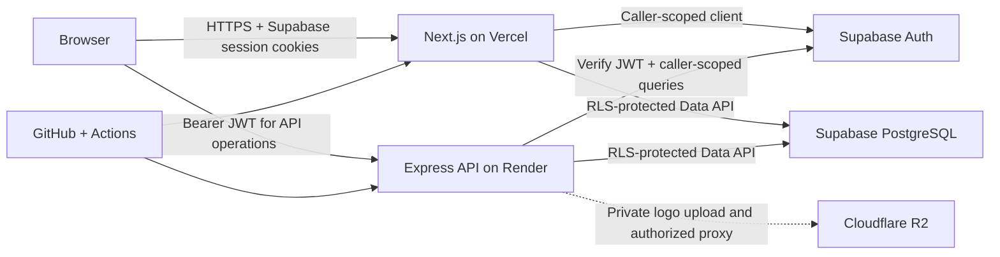

# NEXORA

NEXORA is Beau Roi Technologies Private Limited's B2B product-operations and customer-success platform. It gives Beau Roi employees and customer-company teams a shared, organization-isolated workspace for onboarding, implementation, support, feedback, releases, analytics, and documentation.

This repository contains the secure platform foundation, Milestone 2 customer administration, and Milestone 3 onboarding and implementation workflows. Other product-operations modules remain intentionally staged.

## Milestone status

Implemented:

- Professional public landing page, login, customer registration, legal drafts, and email verification callback
- Responsive Beau Roi and customer portal shells with every requested navigation destination
- Real database-backed overview counts and honest empty states; no demonstration business data is seeded
- Light and dark semantic themes with saved/system preference and reduced-motion support
- Local Bevellier and Supreme variable webfonts loaded through `next/font/local`
- Supabase cookie authentication, database-backed roles, organization memberships, role routing, and RLS
- Extensible PostgreSQL schema for every requested product-operations domain
- Express API with health/readiness checks, validated JWTs, organization-scope enforcement, request IDs, rate limiting, security headers, and consistent errors
- Docker, Render Blueprint, Vercel, GitHub Actions, strict TypeScript, linting, formatting, tests, and environment examples
- Beau Roi customer portfolio search/filter/keyset pagination, customer detail, lifecycle, health, assignment history, people, and audit activity
- Customer organization profile/member administration and secure single-use invitation links
- Feature-gated private Cloudflare R2 company-logo upload/proxy support
- Governed onboarding and implementation portfolios, detailed workspaces, customer read-only views, calculated progress, lifecycle guards, and internal-note isolation

Deferred intentionally:

- Complete ticketing, feedback, release, analytics, and knowledge-base workflows
- Chart.js screens (analytics is currently an empty-state destination)
- SMTP invitation delivery (secure copyable links are available until a provider is approved)
- Final company-approved Terms and Privacy text

## Architecture



Responsibilities remain deliberately narrow:

| Service             | Responsibility                                                                             |
| ------------------- | ------------------------------------------------------------------------------------------ |
| Vercel / Next.js    | Public site, server-rendered application UI, cookie session lifecycle, role-aware routing  |
| Render / Express    | Validated business API boundary, JWT verification, tenant authorization, private R2 access |
| Supabase Auth       | Password hashing, email verification, access and refresh tokens                            |
| Supabase PostgreSQL | Business data, constraints, roles/memberships, database-enforced tenant isolation          |
| Cloudflare R2       | Future private logos, documents, ticket attachments, and knowledge-base files              |
| Cloudflare DNS/CDN  | Added only after a company-owned domain is ready                                           |

## Repository layout

```text
apps/
  web/                 Next.js 16 App Router application
  api/                 Express 5 TypeScript API and Dockerfile
packages/
  contracts/           Shared Zod schemas, roles, routing, and tenant rules
supabase/
  migrations/          Versioned PostgreSQL schema and RLS
  tests/               pgTAP tenant-isolation tests
.github/workflows/     CI quality gate
render.yaml            Render Blueprint
```

## Technology and runtime

- Node.js 24+
- pnpm 11.19.0
- Next.js 16, React 19, Tailwind CSS 4
- Express 5
- Supabase Auth/PostgreSQL with `@supabase/ssr`
- Zod 4 and strict TypeScript 6
- Vitest and Supertest

Dependencies are pinned exactly and `pnpm-lock.yaml` is committed.

## Typography

Only the supplied families are used:

- **Bevellier** (`wght` 100–900): display headings, important titles, brand moments, and major statistics
- **Supreme** (`wght` 100–800): body text, navigation, buttons, tables, labels, and forms

The app copies one normal-style WOFF2 variable file from each supplied package into `apps/web/src/app/fonts`. No Google Fonts or alternate designed family is loaded. Preserve the bundled font license when redistributing the application.

## Local setup

### 1. Install dependencies

```bash
pnpm install --frozen-lockfile
```

### 2. Start local Supabase

Docker Desktop must be running.

```bash
pnpm exec supabase start
pnpm exec supabase status
```

The first command applies `supabase/migrations` automatically. Local email verification messages appear in the Mailpit URL printed by `supabase status`.

To rebuild the local database from migrations:

```bash
pnpm exec supabase db reset
pnpm exec supabase test db
pnpm exec supabase db advisors
```

### 3. Configure local environments

Create ignored local files from the committed examples:

```bash
cp apps/web/.env.example apps/web/.env.local
cp apps/api/.env.example apps/api/.env
```

Use the local URL and publishable/anon key printed by `pnpm exec supabase status`. Do not copy the local service-role key into the web environment.

### 4. Run both applications

```bash
pnpm dev
```

- Web: `http://localhost:3000`
- API health: `http://localhost:4000/health`
- API readiness: `http://localhost:4000/ready`

The app can build without Supabase values so UI verification is not blocked by account setup. Auth submissions clearly report that Supabase is unconfigured until valid values are added.

## Environment variables

### Web (`apps/web/.env.local` and Vercel)

| Variable                               | Visibility   | Purpose                                      |
| -------------------------------------- | ------------ | -------------------------------------------- |
| `NEXT_PUBLIC_SUPABASE_URL`             | Browser-safe | Supabase project URL                         |
| `NEXT_PUBLIC_SUPABASE_PUBLISHABLE_KEY` | Browser-safe | Publishable project key; does not bypass RLS |
| `NEXT_PUBLIC_API_URL`                  | Browser-safe | Public Render API base URL                   |
| `NEXT_PUBLIC_SITE_URL`                 | Browser-safe | Canonical web URL used in auth callbacks     |

### API (`apps/api/.env` and Render)

| Variable                   | Required           | Purpose                                                 |
| -------------------------- | ------------------ | ------------------------------------------------------- |
| `NODE_ENV`                 | Yes                | `development`, `test`, or `production`                  |
| `PORT`                     | Yes                | HTTP port; Render supplies/uses `4000` in the Blueprint |
| `LOG_LEVEL`                | Yes                | Pino log threshold                                      |
| `WEB_APP_URL`              | Yes                | Exact allowed CORS origin                               |
| `SUPABASE_URL`             | Yes                | Supabase project URL                                    |
| `SUPABASE_PUBLISHABLE_KEY` | Yes                | Caller-scoped API access and JWT verification           |
| `R2_ACCOUNT_ID`            | For file workflows | Cloudflare account ID                                   |
| `R2_ACCESS_KEY_ID`         | For file workflows | Server-only R2 credential                               |
| `R2_SECRET_ACCESS_KEY`     | For file workflows | Server-only R2 secret                                   |
| `R2_BUCKET_NAME`           | For file workflows | Private bucket name                                     |

All four R2 variables are validated as an all-or-none group. No service-role, R2 secret, or database password may use a `NEXT_PUBLIC_` prefix.

## Authentication and authorization

Roles are stored as PostgreSQL values on active organization memberships:

- `BEAUROI_ADMIN`
- `BEAUROI_EMPLOYEE`
- `CUSTOMER_ADMIN`
- `CUSTOMER_MEMBER`

Public registration sends organization/profile attributes to Supabase signup. The database trigger creates a `CUSTOMER` organization and fixes the first membership to `CUSTOMER_ADMIN`; it never accepts a role from user-editable metadata. Authorization subsequently reads database memberships only.

Beau Roi accounts must be provisioned administratively with `app_metadata.nexora_account_type = "BEAUROI"`, then assigned to a `BEAUROI` organization. Do not expose a public staff-registration endpoint and do not promote accounts by editing browser-visible metadata. A production provisioning command/admin workflow should be approved by Beau Roi before the first staff user is created.

The Next.js proxy verifies claims to protect authenticated route groups. Each portal layout then loads the active database membership and rejects cross-portal access. The Express API independently verifies the bearer JWT and active membership; UI checks are never treated as authorization.

## Database and migrations

The migrations are:

```text
supabase/migrations/20260814183342_initial_nexora_foundation.sql
supabase/migrations/20260815090632_customer_management_organization_admin.sql
supabase/migrations/20260815143152_restrict_rls_auto_enable_execution.sql
supabase/migrations/20260815145547_milestone_3_onboarding_implementation.sql
```

It creates core organizations, profiles, role definitions, memberships, and the requested extensible domain tables. Every exposed table has RLS enabled. Organization-owned tables include `organization_id`, indexed foreign keys, timezone-aware timestamps, constraints, and conservative policies.

Milestone 2 permissions, endpoints, invitation lifecycle, audit behavior, R2 setup, and safe deployment order are documented in [docs/milestone-2.md](docs/milestone-2.md).

Milestone 3 onboarding/implementation workflows, authorization, endpoints, progress rules, internal-note isolation, and deployment order are documented in [docs/milestone-3.md](docs/milestone-3.md).

Important policy behavior:

- Customer users see only organizations where they have an active membership.
- Customer users cannot enumerate another organization's records.
- Beau Roi access requires an active Beau Roi role inside a `BEAUROI` organization.
- RLS helper functions live in a non-exposed `private` schema and always bind checks to `auth.uid()`.
- User-editable metadata is never used for authorization.
- Global releases/articles are visible to customers only under their explicit published/audience rules.
- Future customer write workflows start closed and receive focused policies when implemented.

To add a migration, always use the CLI so filenames and ordering stay correct:

```bash
pnpm exec supabase migration new descriptive_change_name
```

Test locally, run database advisors, review the SQL, and only then push to the linked cloud project.

## Verification commands

```bash
pnpm format:check
pnpm lint
pnpm typecheck
pnpm test
pnpm build
pnpm verify
```

Database-specific checks:

```bash
pnpm exec supabase db reset
pnpm exec supabase test db
pnpm exec supabase db lint
pnpm exec supabase db advisors
```

Milestone 2 also includes populated-Milestone-1 and concurrent-invitation fixtures under `supabase/compatibility`. These are local-only destructive database checks; run them only against the Supabase CLI development stack as described in `docs/milestone-2.md`.

Build the API container from the repository root:

```bash
docker build -f apps/api/Dockerfile -t nexora-api:milestone-3 .
docker run --rm -p 4000:4000 --env-file apps/api/.env nexora-api:milestone-3
```

## Cloud deployment

### Supabase

1. Create a Supabase cloud project in the company-owned organization and record its region.
2. Link locally with `pnpm exec supabase link --project-ref <project-ref>`.
3. Review with `pnpm exec supabase db push --dry-run`, then apply with `pnpm exec supabase db push`.
4. In Auth URL Configuration, set the production Vercel URL as Site URL and add `<url>/auth/callback` as an allowed redirect.
5. Keep email confirmation enabled and configure company-approved SMTP before a public demonstration.
6. Set the JWT expiry and password rules to match `supabase/config.toml`.

### Vercel

1. Import the GitHub repository as a Vercel project.
2. Set **Root Directory** to `apps/web` and enable inclusion of source files outside the root so `packages/contracts` is available.
3. Add the four web variables for Preview and Production.
4. Deploy. `apps/web/vercel.json` uses the pinned workspace install and Next.js build.

### Render

1. Create a Blueprint from `render.yaml` in the linked GitHub repository.
2. Review the Blueprint region and free development instance. Select a paid plan before production load or SLA commitments.
3. Enter every `sync: false` environment value in Render's encrypted environment settings.
4. Set `WEB_APP_URL` to the final Vercel origin, not a wildcard.
5. Render waits for GitHub checks before auto-deploying and uses `/health` for liveness.

### Cloudflare R2

1. Create a private R2 bucket in Beau Roi's Cloudflare account.
2. Create a least-privilege token restricted to that bucket; never use the global API key.
3. Add the four R2 variables to Render only.
4. Do not enable public bucket access. A later milestone will add authenticated presigned upload/download endpoints and entity-specific file policies.

### GitHub and domains

1. Create a private company-owned GitHub repository and push `main`.
2. Protect `main` and require the **Verify NEXORA** workflow.
3. Connect Vercel and Render through their Git integrations; prefer provider-managed deploys over storing deployment tokens in Actions.
4. Connect a company-owned domain only after Vercel/Render URLs are stable. Configure Cloudflare DNS/CDN without caching authenticated responses or any response containing `Set-Cookie`.

No cloud deployment is performed by this repository alone. Project creation, billing, DNS ownership, and account authorization are explicit owner actions.

## Security notes

- `.env*` files are ignored except examples.
- Passwords go directly to Supabase Auth and are never stored by NEXORA.
- API authorization is independent of frontend navigation.
- Authenticated responses are not eligible for shared CDN caching.
- R2 object keys—not public URLs—are stored in PostgreSQL.
- Legal drafts must be replaced with company-approved text before launch.
- Run Supabase advisors and an external security review before production data is introduced.

## Recommended next milestone

Build **Product Support** next: customer-scoped tickets, messages, SLA timing, attachment metadata with R2 feature gating, Beau Roi triage, customer read/write boundaries, notifications, audit events, and end-to-end RLS tests.
